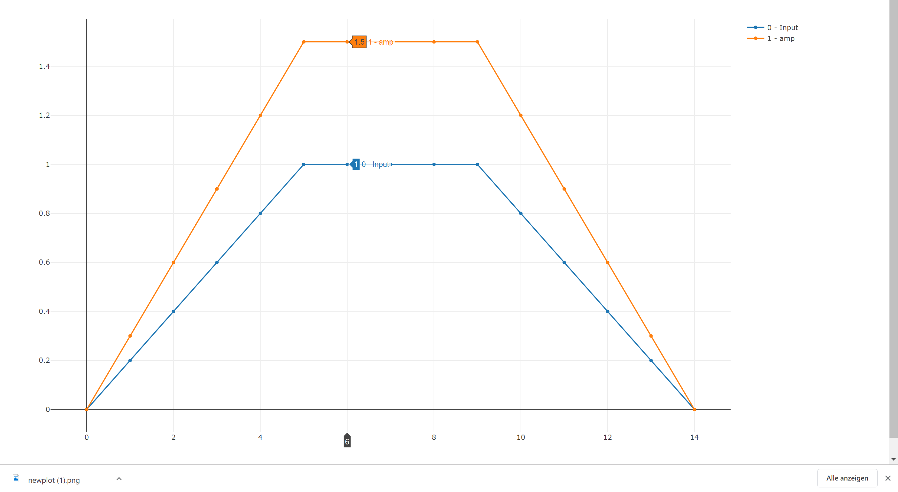
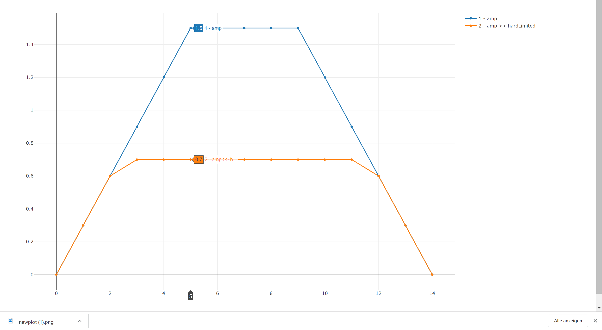
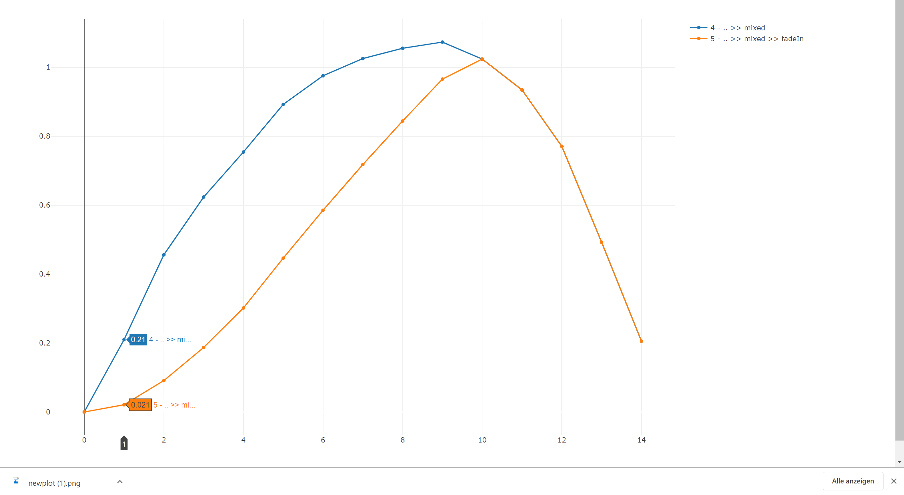
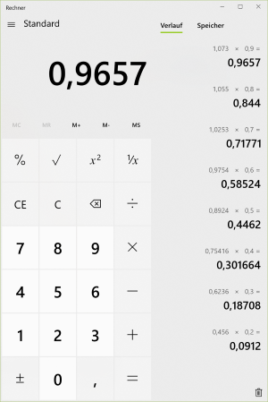
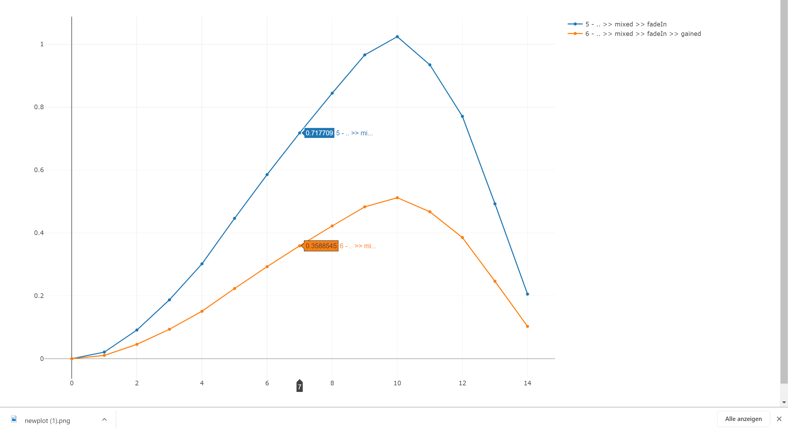
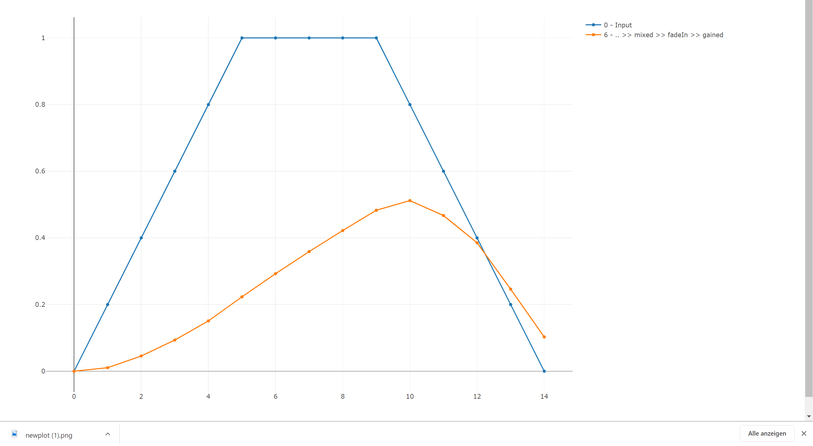

## Analysis

Now we can write blocks, understand the inner mechanism of composing them, and we can evaluate them. Time to have a closer look on our `blendedDistortion` use case. In the following chapter, we will dissect the parts of `blendedDistortion` step by step and retrace the flow of values through our computation.

// TODO: Example link
// To not only look at lists of values, you find a fsx script that uses XPlot - an F# charting library - in combination with Plotly - a web plotting library.

Before we begin: The following samples use a constant set of parameters used in our computations:

```fsharp
let driveConstant = 1.5
let hardLimitConstant = 0.7
let lowPassConstant = 0.4
let mixABConstant = 0.5
let gainConstant = 0.5
let fadeInStepSize = 0.1
```

...and there are some helper functions for evaluating a block against the same set of input values:

```fsharp
let inputValues = [ 0.0; 0.2; 0.4; 0.6; 0.8; 1.0; 1.0; 1.0; 1.0; 1.0; 0.8; 0.6; 0.4; 0.2; 0.0 ]

[<AutoOpen>]
module Helper =

    let toListWithInputValues customBlendedDistortion =
        customBlendedDistortion driveConstant
        |> createEvaluatorWithValues
        <| inputValues
        |> Seq.toList
    
    let chart name items = Scatter(name = name, y = items)
    
    let showAll (x: Scatter list) =
        x
        |> Chart.Plot
        |> Chart.WithWidth 1400
        |> Chart.WithHeight 900
        |> Chart.Show

    let show x = showAll [x]

    let evalWithInputValuesAndChart name customBlendedDistortion =
        chart name (toListWithInputValues customBlendedDistortion)
```

### Amplification

Let's begin with the first part of our effect - the amplification. Beside that, we also show the original input values to compare them:


```fsharp
let inputChart = chart "0 - Input" inputValues

let ampChart = 
    fun drive input -> block {
        let amped = input |> amp drive
        return amped
    }
    |> evalWithInputValuesAndChart "1 - amp"

[ inputChart; ampChart ] |> showAll
```



**Plausibility:**

Since we only amped the signal - which means in our case, we multiply it by a given factor, the result is comprehensive: The `drive` parameter is set to 1.5, which means: multiply every input value by 1.5. Try it - I didn't find a mistake.

<hint>
The effect of the amplifier is not only a "higher volumn", but also a steeper rise and descent of the curve, which - depending on the following process - can result in a stronger distortion (generation of overtones).
</hint>

## Hard Limit

Next, the limiter comes in the game: It takes the amplified value, and limits it to a given amount - in our case, 0.7.

```fsharp
let ampHardLimitChart =
    fun drive input -> block {
        let amped = input |> amp drive
        let hardLimited = amped |> limit hardLimitConstant
        return hardLimited
    }
    |> evalWithInputValuesAndChart "2 - amp >> hardLimited"
```



## Low Pass

The low pass is next, and interesting: It is - like the hard limiter - fed by the amplified value. One way of understanding a low pass is that it "follows" a given input signal. We implemented the low pass as a so-called "first order lag element", from the electronic analog currency-resistor-condenser.

Looking at the chart, we see that the low passed signal follows it's input (the amplified signal), but never reaches it because it's too slow :) When the original signal drops, it is again "faster" than the low pass output. Low pass is always slower, and that's the way it shall be.

```fsharp
let ampLowPassChart =
    fun drive input -> block {
        let amped = input |> amp drive
        let! softLimited = amped |> lowPass lowPassConstant
        return softLimited
    }
    |> evalWithInputValuesAndChart "3 - amp >> lowPass"

[ ampChart; ampLowPassChart ] |> showAll
```


## Mix

Mix is easy, since we have to "time" (=state) incorporated. It is completely linear and can be calculated with values at one single point in time, without looking at state or past values.

```fsharp
let mixedChart =
    fun drive input -> block {
        let amped = input |> amp drive
        let hardLimited = amped |> limit hardLimitConstant
        let! softLimited = amped |> lowPass lowPassConstant
        let mixed = mix 0.5 hardLimited softLimited
        return mixed
    }
    |> evalWithInputValuesAndChart "4 - .. >> mixed"

[ ampHardLimitChart; ampLowPassChart; mixedChart ] |> showAll
```


## Fade In

We analyzed at fade in before - when we had a look at evaluating blocks: We saw that the state value increased by the given step size of 0.1 every cycle. That was the inner view - we coudn't check if the final calculation was correct. Now we can: The input of fadeIn (which is the "mix" value) has to be multiplied by the corresponding state value [ 0; 0.1; 0.2 ;...]. Now beleive it or not - I double checked all the values, and the assumption is true! (I'm happy if you don't beleive me and check the facts on your own - it's easy!).

```fsharp
let mixedFadeInChart =
    fun drive input -> block {
        let amped = input |> amp drive
        let hardLimited = amped |> limit hardLimitConstant
        let! softLimited = amped |> lowPass lowPassConstant
        let mixed = mix mixABConstant hardLimited softLimited
        let! fadedIn = mixed |> fadeIn fadeInStepSize 0.0
        return fadedIn
    }
    |> evalWithInputValuesAndChart "5 - .. >> mixed >> fadeIn"

[ mixedChart; mixedFadeInChart ] |> showAll
```





## Gain

Now the output gain stage:

```fsharp
let finalChart =
    fun drive input -> block {
        let amped = input |> amp drive
        let hardLimited = amped |> limit hardLimitConstant
        let! softLimited = amped |> lowPass lowPassConstant
        let mixed = mix mixABConstant hardLimited softLimited
        let! fadedIn = mixed |> fadeIn fadeInStepSize 0.0
        let gained = amp gainConstant fadedIn
        return gained
    }
    |> evalWithInputValuesAndChart "6 - .. >> mixed >> fadeIn >> gained"

[ mixedFadeInChart; finalChart ] |> showAll
```



This is also just an amplifier, which we parametrized with 0.5.


## Input - Final

And finally - just for fun - the original input values compared to the final result:

```fsharp
[ inputChart; finalChart ] |> showAll
```



